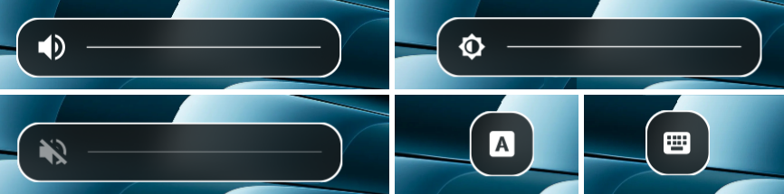

# hyprosd



Simple Hyprland OSD for volume, brightness, Caps Lock, and Num Lock.

[View on AUR](https://aur.archlinux.org/packages/hyprosd-git)

## Install

```bash
yay -S hyprosd-git
# or
paru -S hyprosd-git
```

Manual:

```bash
git clone https://github.com/jameswylde/hyprosd.git
cd hyprosd
./scripts/install.sh
```

## Hyprland Setup

Start the daemon:

```ini
exec-once = hyprosd daemon
```

For manual installs where `~/.local/bin` is not in your session `PATH`:

```ini
exec-once = ~/.local/bin/hyprosd-daemon
```

Example keybinds:

```ini
bind = ,XF86AudioLowerVolume, exec, wpctl set-volume @DEFAULT_AUDIO_SINK@ 5%- && hyprosd show volume
bind = ,XF86AudioRaiseVolume, exec, wpctl set-volume @DEFAULT_AUDIO_SINK@ 5%+ && hyprosd show volume
bind = ,XF86AudioMute, exec, wpctl set-mute @DEFAULT_AUDIO_SINK@ toggle && hyprosd show volume

bind = ,XF86MonBrightnessDown, exec, brightnessctl s 10%- && hyprosd show brightness
bind = ,XF86MonBrightnessUp, exec, brightnessctl s +10% && hyprosd show brightness
```

The example keybinds use `wpctl` and `brightnessctl`.

Optional blur rules:

```ini
layerrule = blur on, match:namespace hyprosd
layerrule = ignore_alpha 0.1, match:namespace hyprosd
```

## Uninstall

```bash
sudo pacman -R hyprosd-git
```

Manual installs:

```bash
./scripts/uninstall.sh
```
